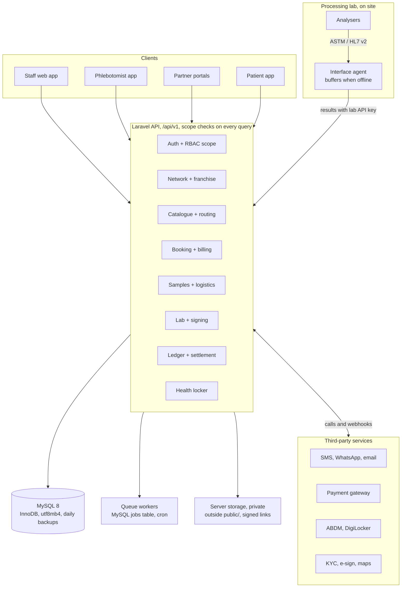

# Pathology Network Platform — Backend Technical Specification

Version: 5 Oct 2026

## 1. Purpose, scope and glossary

The backend runs one pathology brand (the head office) whose tests are booked at company-owned branches, franchise branches and B2B clients, processed in a hub-and-spoke lab network, signed by qualified doctors, and settled financially with every partner. This spec is the build reference: architecture, third-party services, access rules, workflows, every table and column, the API, jobs, compliance and build order.

The data model matches the v3 ER diagram in the Eraser file "Pathology Management Application - Core ER Diagram" plus the Engine 17 health-locker diagram. Where this doc and a diagram disagree, raise it before writing migrations.

**In scope:** head office and regions, branches (own and franchised), franchise onboarding, B2B clients, catalogue and pricing, booking, home collection, billing, sample logistics, lab results, report signing and release, partner ledger and settlements, inventory transfers, auth and RBAC, notifications, audit, ABHA/ABDM, and the patient health locker (Engine 17).

**Out of scope for v1:** radiology/PACS, HR and payroll, doctor referral commissions (prohibited for doctors under NMC ethics rules, see Section 10), and full accounting (we export to the accountant's system instead).

### Glossary

| Term | Meaning in this system |
| --- | --- |
| Organization / Head office (HQ) | The brand that owns the catalogue, prices, network and all data. One row in `organizations`. Super Admin works here. |
| Region | Zone, state or city grouping used to scope regional managers. Nested via `parent_region_id`. |
| Branch | Any physical site. Owned by HQ (`owner_type = company`) or by a franchise (`owner_type = franchise`). |
| Reference lab | Large HQ lab for specialised and esoteric tests. `branch_type = reference_lab`. |
| Clinical lab | Processing lab for routine tests, serving nearby collection sites. `branch_type = clinical_lab`. |
| PSC | Patient Service Centre: walk-in collection site, no testing. `branch_type = psc`. |
| Pick-up point (PUP) | Site where hospitals or clinics drop specimens. `branch_type = pickup_point`. |
| Franchise | An outside business that runs one or more branches under the brand, under a signed agreement. |
| B2B client | Hospital, nursing home, clinic, other lab or corporate that sends samples on credit at its own rate list. |
| MRP | Price shown to and paid by the patient. |
| Partner price | Price HQ charges a franchise or B2B client per test. |
| Revenue-share model | Franchise earns `commission_pct` of what it bills; HQ keeps the rest. |
| Wholesale model | Franchise buys each test at partner price from a prepaid wallet and keeps the MRP difference. |
| Processing branch | The lab that will run a given test, chosen by routing rules. |
| Manifest | One courier batch of samples moving between branches. |
| Signatory | A doctor legally allowed to sign reports for a department at a lab (qualification + council registration). |
| UHID | Network-wide unique patient ID, valid at every branch. |
| ABHA | Ayushman Bharat Health Account: the patient's national health ID under ABDM. |
| TAT | Turnaround time from sample receipt to report release, in hours. |

## 2. System architecture

Build a modular monolith: one API codebase split into eight modules with clear boundaries, one MySQL 8 database, queue workers backed by a MySQL jobs table, and a private storage folder on the same server for files. Split a module into its own service only when its load demands it; the lab interface agent is the only piece that runs outside the cloud.



Every app talks only to the API; workers handle PDFs, notifications and settlements; labs push analyser results through the on-site agent.

### Modules and what they own

| Module | Tables owned | Talks to |
| --- | --- | --- |
| Auth + RBAC scope | accounts, auth_sessions, otp_verifications, password_resets, roles, permissions, role_permissions | SMS vendor |
| Network + franchise | organizations, regions, branches, franchises, franchise_agreements, franchise_documents, b2b_clients, users, signatories | KYC, e-sign |
| Catalogue + routing | departments, tests, test_parameters, test_reference_ranges, packages, package_tests, price_lists, price_list_items, lab_test_capabilities, test_routing_rules | none |
| Booking + billing | patients, doctors, orders, order_items, home_collections, invoices, payments, refunds, payment_webhook_events, abdm_requests | Payment gateway, maps, ABDM |
| Samples + logistics | samples, sample_order_items, sample_transfers, sample_transfer_items, inventory_items, stock_transfers | Label printers |
| Lab + signing | lab_results, reports, report_signatures | Interface agent, PDF renderer |
| Ledger + settlement | partner_ledger, settlements, settlement_items | Payment gateway, accounting export |
| Health locker | the 12 Engine 17 tables, abdm_care_contexts | ABDM, DigiLocker |
| Shared | audit_logs, notification_templates, notifications | Messaging vendors |

A module may read another module's tables only through that module's service classes, never by direct query. This keeps the later split into services possible.

### Environments

Four environments: local (Docker Compose), dev, staging (production-like data volume with masked data), and production. Deploys go through CI with migrations, tests and a smoke test; production deploys need one approval.

## 3. Tech stack and third-party services

Recommended stack: Laravel (PHP 8.3+) on MySQL 8 (Hostinger default), Laravel's database queue and cache drivers (no Redis), files stored on the same server in a private folder, and a small on-premise interface agent in each processing lab.

### Core stack

| Layer | Choice | Why | Watch out for |
| --- | --- | --- | --- |
| API framework | Laravel (latest stable), PHP 8.3+ | Migrations, queues, policies, morph relations, Sanctum tokens built in | Pin PHP version in Hostinger panel to match local |
| Database | MySQL 8, InnoDB, utf8mb4 / utf8mb4_0900_ai_ci | Provided by Hostinger; CHECK constraints work from 8.0.16 | No row-level security, no sequences, no partial indexes; see Section 6 for workarounds |
| Queues | Laravel `database` queue driver (`jobs`, `failed_jobs`, `job_batches` tables) | No Redis needed; jobs survive restarts | Slower at high volume; keep jobs small |
| Cache and locks | Laravel `database` cache driver (`cache`, `cache_locks` tables) | `Cache::lock()` still works for invoice and barcode numbering | Do not cache large objects; clear expired rows with a daily prune |
| Sessions | `database` or `file` driver | | Use database driver if you later run more than one web server |
| File storage | Laravel `local` disk at `storage/app/private` on the same server | No extra service; one backup covers it | Never under `public/`; see the storage note below |
| Search | MySQL FULLTEXT index (ngram parser) on patient name, plain index on phone and UHID | No extra search service | ngram works for partial names; exact phone lookup uses the plain index |
| PDF rendering | VPS: headless Chromium via Browsershot. Shared hosting: DomPDF or mPDF | Chromium gives the best report layout | Shared hosting cannot run Chromium; test report templates with the engine you will use |
| Lab instrument interface | On-prem agent speaking ASTM E1381/E1394 and HL7 v2 | Analysers push results; agent posts them to the API | Must buffer results when the lab's internet drops |
| Hosting | Hostinger VPS (recommended) or Business/Cloud shared plan | Supervisor-run workers, Chromium, SSH, cron | Shared plans allow cron but not long-running workers |
| Monitoring | Sentry, Laravel Pulse or Telescope (staging only), uptime checks | Errors, slow queries, failed jobs | Do not enable Telescope in production |

### File storage on the server

Store files on the same server, but in `storage/app/private`, never in the `public/` folder. Anything under `public/` can be downloaded by anyone who has or guesses the URL, and reports, KYC papers and signature images are health and identity data protected by law (Section 10). This costs nothing extra and keeps your single-server setup.

1. Folder layout: `private/reports/{yyyy}/{mm}/{report_id}_v{version}.pdf`, `private/kyc/{franchise_id}/`, `private/signatures/{signatory_id}.png`, `private/uploads/locker/{patient_id}/`, `private/invoices/{yyyy}/{mm}/`.
2. File names use IDs, never patient names or phone numbers.
3. Downloads go through a controller: check the user's scope, log the access, then stream the file. Patients and doctors get `URL::temporarySignedRoute` links that expire (24 to 72 hours).
4. Only the brand logo and static assets live in `public/`.
5. Watch disk quota: reports grow every day. Add a disk-usage alert at 80% and plan a move to Hostinger object storage or S3 later; with Laravel's storage layer that is a config change, not a code change.
6. Back up `storage/app/private` nightly to a location off this server (Section 11).

### Running queues and the scheduler without Redis

- **On a VPS:** run `php artisan queue:work database --queue=critical,default,low --tries=3 --max-time=3600` under Supervisor, and a cron entry `* * * * * php artisan schedule:run`.
- **On shared hosting:** only cron is available. Run `schedule:run` every minute, and schedule `queue:work --stop-when-empty --max-time=55` inside it with `withoutOverlapping()`. Jobs then start within about a minute, which is fine for PDFs and messages but slow for critical-value alerts; send those synchronously after commit instead.

### Third-party services

| Need | Service options | Used for | Notes for the developer |
| --- | --- | --- | --- |
| SMS + OTP | MSG91, Gupshup, Kaleyra | Login OTP, report-ready, home-collection updates | Every template must be registered on TRAI DLT with sender ID before sending in India |
| WhatsApp | Meta Cloud API direct, or a BSP (Gupshup, Interakt, AiSensy) | Report PDF delivery, booking confirmation | Template messages need Meta approval; store approved template names in `notification_templates` |
| Email | Amazon SES, SendGrid, Postmark | Reports, invoices, settlement statements | Set SPF, DKIM, DMARC on the sending domain |
| Payments | Razorpay, Cashfree, PayU | Patient payments, UPI, franchise wallet top-up, B2B dues | Treat webhooks as source of truth; verify signatures; idempotent on gateway payment ID |
| GST e-invoicing | A GSP such as ClearTax or Masters India, to the IRP | Taxable B2B invoices (franchise fee, royalty, kits) | Patient test invoices are usually GST-exempt healthcare services; confirm with the CA |
| KYC checks | Signzy, Surepass, Perfios | PAN, GSTIN and bank-account verification at franchise onboarding | Store only the verification result and reference ID, not raw API dumps |
| Agreement e-sign | Leegality, Digio | Franchise agreement signing with Aadhaar eSign | Save signed PDF to `franchise_agreements.signed_doc_path` |
| Maps and routing | Google Maps Platform, Ola Maps, Mapbox | Geocoding home-collection addresses, nearest branch, phlebotomist route | Cache geocodes on the row (`latitude`, `longitude`) |
| ABDM | ABDM sandbox then production (ABHA, HFR, HPR, HIP/HIU) | ABHA create/verify/link, pushing reports to patient PHR apps, consent flows | Each lab branch registers in the Health Facility Registry; each signatory in the Health Professional Registry. See Section 5.7 |
| DigiLocker | DigiLocker partner API (via API Setu) | Optional pull of patient documents into the health locker | Phase 9; needs separate onboarding |
| Barcode printing | Zebra or TSC label printers, ZPL templates | Sample tube labels, Code 128 | Print from browser via a local print agent or QZ Tray |
| Accounting export | Tally (XML export), Zoho Books API | Monthly sales and settlement journals | Export only; the platform is not the books of account |
| Error and log tooling | Sentry, server log files | Exceptions, structured logs | Strip patient names and phone numbers from logs |

All vendor credentials live in the server's environment file, kept outside the web root with file permission 600, never in `.env` files committed to git. Wrap each vendor behind an interface (`SmsSender`, `PaymentGateway`, `PdfRenderer`, `AbdmClient`) so a vendor can be swapped without touching business code.

## 4. Multi-tenancy, data scoping and RBAC

Every request is checked twice: the role must hold the permission, and the row must fall inside the user's scope. Scope comes from `roles.scope_level` plus the IDs stored on the user. Enforce it in one place (a global query scope or repository layer), and back it with an automated test per role and endpoint, because MySQL has no row-level security to catch a missed filter.

### Scope levels

| scope_level | User columns that must be set | Rows the user can see |
| --- | --- | --- |
| organization | `organization_id` | Everything in the organization |
| region | `organization_id`, `region_id` | Branches, franchises, B2B clients whose `region_id` is that region or any child region |
| franchise | `organization_id`, `franchise_id` | Rows where `franchise_id` matches, or `branch_id` belongs to one of that franchise's branches |
| branch | `organization_id`, `branch_id` | Rows where `branch_id` matches; processing labs also see samples where `processing_branch_id` matches |
| b2b_client | `organization_id`, `b2b_client_id` | Orders, reports, invoices and ledger rows where `b2b_client_id` matches; read-mostly |

Two rules need special care. A processing lab sees samples and results from other branches (and other franchises) because it tests them, but it must not see their invoices, payments or ledger. Patients are network-wide by UHID, so any branch may search a patient by phone or UHID, but it sees order and report history only inside its own scope unless the patient grants access.

### Standard roles

| Role | scope_level | Typical permissions |
| --- | --- | --- |
| Super Admin | organization | Everything, including `manage_organization`, `manage_roles` |
| HQ Operations | organization | `manage_branches`, `manage_routing`, `view_all_reports`, `manage_catalog` |
| HQ Finance | organization | `manage_price_lists`, `approve_settlement`, `post_ledger_adjustment`, `view_all_invoices` |
| Franchise Manager (HQ) | organization or region | `onboard_franchise`, `verify_kyc`, `approve_agreement`, `suspend_franchise` |
| Regional Manager | region | `view_region_dashboard`, `view_branches`, `view_reports` |
| Franchise Owner | franchise | `view_franchise_dashboard`, `view_ledger`, `topup_wallet`, `manage_franchise_staff` |
| Branch Admin | branch | `manage_branch_staff`, `view_branch_reports`, `manage_inventory` |
| Front Desk | branch | `register_patient`, `create_order`, `collect_payment`, `print_barcode` |
| Phlebotomist | branch | `view_assigned_collections`, `mark_collected` |
| Logistics Runner | branch | `create_manifest`, `receive_manifest` |
| Lab Technician | branch | `accession_sample`, `reject_sample`, `enter_results` |
| Lab Supervisor | branch | `verify_results`, `rerun_test` |
| Signatory (Pathologist, Microbiologist, Biochemist) | branch | `sign_report` (only for their department), `amend_report` |
| B2B Client User | b2b_client | `create_b2b_order`, `view_client_reports`, `view_client_ledger` |
| Patient | none (separate guard) | Own reports, health locker, consents |
| Referring Doctor | none (separate guard) | Reports shared with them by consent |

Roles with `is_system = true` are seeded and cannot be deleted. HQ may create extra roles, but a role can never hold a permission above its scope level (for example a branch-scoped role cannot get `approve_settlement`).

### Implementation notes

1. Resolve the user's scope once per request into a `ScopeContext` object (organization, region IDs including children, franchise ID, branch IDs).
2. Apply it with a global Eloquent scope (`BelongsToScope` trait) on every scoped model. Raw `DB::table()` queries on scoped tables are banned by a code-review rule and a static check in CI.
3. Background jobs run with an explicit system scope, never an empty one.
4. Every denied access returns 404, not 403, for rows outside scope, so IDs from other franchises cannot be probed.
5. Give the app a MySQL user with only SELECT, INSERT, UPDATE, DELETE on app tables, and only SELECT, INSERT on `audit_logs`, `record_access_logs` and `partner_ledger`.

## 5. Business workflows and state machines

Seven workflows carry the business; each status column below may only move along the listed transitions, enforced in a single service method per entity (never by writing `status` directly from a controller). Every transition writes an `audit_logs` row.

### 5.1 Franchise onboarding

1. HQ Franchise Manager creates the franchise (`status = applied`) with owner, address, region.
2. Franchise uploads KYC documents (PAN, GST, address proof, bank proof, premises photos). Each is verified through the KYC vendor and then by a person (`franchise_documents.status`).
3. HQ drafts the agreement: model (PSC or lab), billing model, commission or partner price list, fee, deposit, territory, cycle.
4. Agreement goes to e-sign; on signature webhook, `franchise_agreements.status = active`.
5. HQ creates the franchise's branches (`owner_type = franchise`), assigns routing rules, creates the Franchise Owner user.
6. For the wholesale model, the franchise tops up its wallet; deposit and fee are posted to `partner_ledger`.
7. Franchise `status = active`; branches go live.

| Entity | From | To | Trigger | Who |
| --- | --- | --- | --- | --- |
| franchises | applied | kyc_pending | First document uploaded | Franchise / HQ |
| franchises | kyc_pending | approved | All mandatory documents verified | Franchise Manager |
| franchises | approved | active | Agreement active and at least one branch created | System |
| franchises | active | suspended | Overdue dues past limit, compliance issue | HQ Finance / Franchise Manager |
| franchises | suspended | active | Issue cleared | Franchise Manager |
| franchises | any | terminated | Agreement ended or cancelled | Super Admin |
| franchise_agreements | draft | sent_for_sign | Sent to e-sign vendor | Franchise Manager |
| franchise_agreements | sent_for_sign | active | Signed webhook received | System |
| franchise_agreements | active | expired / terminated | `end_date` passed / manual | System / Super Admin |

A suspended franchise's branches cannot create orders; existing samples still get processed and reports released.

### 5.2 Booking and billing

1. Front desk searches the patient by phone or UHID; creates one if missing (UHID generated by HQ sequence). ABHA can be linked here (Section 5.7).
2. Front desk creates an order with tests/packages. The system resolves, per item: MRP (branch price list, else organization default), partner price (franchise or B2B client price list), and `processing_branch_id` from routing rules.
3. Invoice is generated. Walk-in patients pay now (cash, card, UPI). B2B orders are billed to the client on credit.
4. For a wholesale franchise, the partner price of every item is debited from the wallet at order confirmation; if the balance plus `credit_limit` is insufficient, the order is blocked.
5. For a revenue-share franchise, nothing is debited; the commission is computed at settlement.

| Entity | From | To | Trigger |
| --- | --- | --- | --- |
| orders | draft | confirmed | Invoice created and payment rule met |
| orders | confirmed | in_progress | First sample collected |
| orders | in_progress | partially_reported | Some reports released |
| orders | partially_reported / in_progress | completed | All items reported |
| orders | draft / confirmed | cancelled | Cancelled before collection; refund and ledger reversal |
| invoices | unpaid | partially_paid / paid | Payments posted |
| invoices | paid | refunded / partially_refunded | Refund processed |

### 5.3 Home collection

1. Order source `home_collection` creates a `home_collections` row with address, geocode and slot.
2. Branch admin (or auto-assign by distance) assigns a phlebotomist.
3. Phlebotomist app: start trip, reach, collect, print or scan barcode labels, take payment if due.
4. Samples are handed to the branch and join the next manifest.

Statuses: `scheduled → assigned → en_route → collected → handed_over`, with side exits `rescheduled`, `cancelled`, `failed` (patient not available).

### 5.4 Sample journey (hub and spoke)

1. At collection, one sample row is created per container (not per test). Barcode is unique across the organization.
2. Samples whose `processing_branch_id` differs from the collecting branch are added to a manifest (`sample_transfers`) to that lab. One manifest goes to one destination.
3. Runner dispatches with courier name and temperature check.
4. Receiving lab scans each barcode: accepted, or rejected with a reason (haemolysed, clotted, insufficient volume, leaked, wrong container, unlabelled, temperature breach, delayed).
5. Rejection notifies the collecting branch and patient; a recollection order item is created at no charge.
6. Accepted samples go to the analysers; if the lab cannot run a test, it re-routes the sample onward (a new manifest).

| Entity | From | To |
| --- | --- | --- |
| samples | pending_collection | collected |
| samples | collected | in_transit (added to dispatched manifest) |
| samples | in_transit / collected | received (at processing lab) |
| samples | received | rejected (terminal; triggers recollection) |
| samples | received | in_process → processed |
| samples | processed | stored → discarded (retention policy) |
| sample_transfers | created → dispatched → received / partially_received | |

### 5.5 Results, signing and report release

1. Results arrive from the analyser agent or manual entry (`entered_by`). Values outside reference range get a flag (L, H, critical L, critical H).
2. Critical values trigger an immediate alert to the branch and referring doctor (phone call logged).
3. Lab supervisor verifies results.
4. A report is built per order. A department's section can only be signed by an active signatory of that department at that lab (`signatories.valid_till` not passed).
5. When every department in the order is signed, the report is released: PDF rendered, QR code generated, patient and doctor notified, health-locker record created, ABDM push if linked.
6. Corrections after release create a new report version (`version + 1`, `status = amended`) with a reason; the old PDF is kept, never overwritten.

Report statuses: `draft → pending_signature → signed → released`, then `amended` (new version) or `withheld` (unpaid B2B or dues policy, configurable).

### 5.6 Money: ledger and settlement

1. Every financial event between HQ and a partner is one `partner_ledger` row: wallet top-up (credit), partner charge per order item (debit), commission earned (credit), franchise fee (debit), deposit (credit), kit supply from `stock_transfers` (debit), refund reversal, manual adjustment.
2. `balance_after` is computed inside a transaction with a row lock on the partner, so balances never race.
3. At each cycle end (weekly or monthly from the agreement) a job builds a settlement per partner from unsettled ledger rows, links them via `settlement_items`, and computes gross billing, partner share, HQ share, tax and net.
4. HQ Finance reviews and approves; payment or collection is recorded; `status = settled`.

Settlement statuses: `draft → pending_approval → approved → settled`, side exit `disputed → approved`. A ledger row belongs to at most one settlement (unique `ledger_entry_id`).

Company-owned branches never touch the ledger; their invoices are HQ revenue directly.

### 5.7 ABHA integration (ABDM)

The front desk can create, verify or scan a patient's ABHA at registration (ABDM milestone M1), and released reports can later be pushed to the patient's ABHA-linked health apps (M2, as a Health Information Provider). M1 is built with booking in Phase 3; M2 stays in Phase 8. Before any of this, the organization must onboard on the ABDM sandbox and request the ABHA API role for its client ID; ABHA API access depends on that onboarding request ([ABHA v3 SDK notes](https://pypi.org/project/abha/1.0.0/)).

**Four front-desk paths (M1)**

1. **Patient has an ABHA number or address:** enter it, ABDM sends an OTP to the patient, verify, fetch the ABHA profile, link it to the patient.
2. **Patient shows the ABHA QR:** scan it with the desk scanner or phone, read the ABHA number and address, then verify by OTP as above.
3. **Patient has no ABHA, has Aadhaar:** request an Aadhaar OTP, enrol by Aadhaar, let the patient pick an ABHA address from ABDM's suggestions. The v3 enrolment endpoints are `POST /v3/enrollment/request/otp` and `POST /v3/enrollment/enrol/byAadhaar`, with `GET /v3/enrollment/enrol/suggestion` for addresses ([SDK reference](https://pypi.org/project/abha/1.0.0/)). Confirm exact paths in the ABDM sandbox docs during onboarding.
4. **Patient uses "Scan and Share":** each lab branch displays its Health Facility Registry QR; the patient scans it in their ABHA app, ABDM calls our callback with the profile, and the front desk sees the patient pre-filled in a queue.

A patient without ABHA is always registered normally; ABHA is optional and must never block a booking.

**Rules the code must follow**

1. Never store the Aadhaar number. It passes through encrypted to ABDM and is dropped; only the ABHA number, address and the KYC-verified flag are kept.
2. Encrypt Aadhaar numbers, OTPs and mobile numbers with ABDM's public key before sending, as the v3 APIs require ([v3 reference](https://medium.com/@devlprnitish/abdm-abha-v3-api-complete-reference-guide-761d91cefb94)).
3. Show and record the patient's consent before enrolment or linking; store the consent version sent.
4. If ABHA demographics differ from what the patient gave the desk (name spelling, date of birth), show both and let staff choose; never overwrite silently.
5. ABDM gateway tokens are cached in the database cache and refreshed before expiry; patient user tokens (`X-Token`) are kept only for the length of the desk session.
6. Use the sandbox base URL in dev and staging and the production URL only after certification; keep both in config.

**Patient table ABHA columns** (these replace `abha_id` / `abha_address` in 7.3)

| Column | Type | Null | Notes |
| --- | --- | --- | --- |
| abha_number | varchar(17) | yes | U; stored as 14 digits with hyphens (xx-xxxx-xxxx-xxxx) |
| abha_address | varchar(100) | yes | U; e.g. name@abdm |
| abha_status | varchar(32) | no | not_linked, linked, unlinked; CHECK |
| abha_kyc_verified | boolean | no | default false; true when created or verified via Aadhaar |
| abha_linked_at | datetime(6) | yes | |
| abha_linked_by | char(36) | yes | FK users |
| abha_profile_snapshot | json | yes | Name, gender, year of birth, mobile as returned by ABDM; no Aadhaar |

**abdm_requests** — log of every call to and callback from ABDM.

| Column | Type | Null | Notes |
| --- | --- | --- | --- |
| patient_id | uuid | yes | FK patients |
| branch_id | uuid | yes | FK branches |
| direction | varchar(16) | no | outbound, callback |
| api_name | varchar(80) | no | e.g. enrol_by_aadhaar, verify_otp, profile_share, link_care_context |
| request_id | varchar(64) | no | U; ABDM request ID for matching callbacks |
| txn_id | varchar(64) | yes | ABDM transaction ID across OTP steps |
| http_status | smallint | yes | |
| status | varchar(32) | no | pending, success, failed, timeout |
| error_code | varchar(50) | yes | |
| payload_masked | json | yes | Request and response with OTP, Aadhaar, tokens removed |
| requested_by | uuid | yes | FK users |

**abdm_care_contexts** — one per released report linked to the patient's ABHA (M2).

| Column | Type | Null | Notes |
| --- | --- | --- | --- |
| patient_id | uuid | no | FK patients |
| report_id | uuid | no | FK reports; U |
| care_context_reference | varchar(100) | no | U; our ID shared with ABDM |
| display_name | varchar(200) | no | e.g. "Lab report, 05 Oct 2026, Patna Clinical Lab" |
| hi_type | varchar(40) | no | DiagnosticReport |
| link_status | varchar(32) | no | pending, linked, failed |
| linked_at | datetime(6) | yes | |

**ABHA endpoints (our API)**

| Method and path | Permission | Purpose |
| --- | --- | --- |
| POST /abha/verify/request-otp | register_patient | Send OTP for an existing ABHA number or address |
| POST /abha/verify/confirm | register_patient | Verify OTP, return profile, link to patient |
| POST /abha/scan | register_patient | Parse scanned ABHA QR, then start verification |
| POST /abha/enrol/aadhaar/request-otp | register_patient | Start Aadhaar-based creation |
| POST /abha/enrol/aadhaar/confirm | register_patient | Create ABHA and return address suggestions |
| POST /abha/address | register_patient | Set the chosen ABHA address |
| GET /patients/{id}/abha-card | register_patient | Download ABHA card PDF for printing |
| POST /patients/{id}/abha/unlink | register_patient | Remove the link (keeps history in abdm_requests) |
| GET /abha/share-queue?branch_id | register_patient | Profiles received by Scan and Share, waiting for the desk |
| POST /abdm/callbacks/* | ABDM gateway signature | Profile share, link and data-transfer callbacks |

**What each milestone needs**

| Milestone | Our role | Must be built | When |
| --- | --- | --- | --- |
| M1 | ABHA at registration | Four front-desk paths, profile fetch, ABHA card, Scan and Share, HFR ID per lab branch | Phase 3 |
| M2 | Health Information Provider | Care-context linking on report release, consent-based data transfer as FHIR DiagnosticReport, encryption of shared data, HPR ID per signatory | Phase 8 |
| M3 | Health Information User | Pull a patient's past records from other providers with consent (health locker) | Optional, after M2 |

## 6. Database conventions and enumerations

All tables follow the same ten rules, so the data dictionary in Section 7 lists only business columns.

1. **Engine and charset:** InnoDB, `utf8mb4`, collation `utf8mb4_0900_ai_ci`, `sql_mode` strict (Laravel default).
2. **Primary keys:** `id char(36)` holding a time-ordered UUID from Laravel's `HasUuids` trait. Never expose sequential IDs. (Optional later optimisation: `binary(16)`.)
3. **Timestamps:** every table has `created_at` and `updated_at` as `datetime(6)`. Set the app and the MySQL session to UTC; display in Asia/Kolkata. Avoid `timestamp` columns, which stop at the year 2038.
4. **Soft delete:** master and people tables (`organizations` to `doctors`, catalogue, price lists) have `deleted_at datetime(6) null`. Transaction tables (orders, invoices, payments, ledger, results, reports, logs) are never deleted; they are cancelled, reversed or versioned.
5. **Actor columns:** every mutable table has `created_by char(36) null` and `updated_by char(36) null` referencing `users.id`.
6. **Money:** `decimal(12,2)` in INR. Never float or double. Percentages `decimal(5,2)`.
7. **Enumerations:** `varchar(32)` with a CHECK constraint listing allowed values (works on MySQL 8.0.16+), plus a PHP backed enum in code. Values are lower snake_case.
8. **Foreign keys:** `on delete restrict` everywhere, except pure child rows (`price_list_items`, `package_tests`, `role_permissions`, `sample_transfer_items`, `settlement_items`) which use `cascade`.
9. **Human-readable numbers:** MySQL has no sequences. Use a `number_sequences` table (`organization_id`, `series_key`, `financial_year`, `next_value`, unique on the first three) and take the next number with `SELECT … FOR UPDATE` inside the same transaction that saves the invoice, order or barcode. Never `max()+1`. Formats are configurable, e.g. `INV/{branch_code}/{FY}/{seq}`; invoice series restart each financial year (April).
10. **Laravel system tables:** `jobs`, `failed_jobs`, `job_batches`, `cache`, `cache_locks`, `sessions`, `number_sequences` are part of the schema but not of the business data dictionary.

### How Section 7 terms map to MySQL 8

Section 7 writes types in short form; build them in MySQL exactly as this table says.

| Term used in Section 7 | Build in MySQL 8 as |
| --- | --- |
| uuid | `char(36)`; foreign keys also `char(36)` |
| numeric(p,s) | `decimal(p,s)` |
| timestamptz | `datetime(6)`, stored in UTC |
| jsonb | `json` (validated JSON; index a field with a generated column if you must filter on it) |
| inet | `varchar(45)` (fits IPv6) |
| char(64) hash | `char(64)` with `ascii` charset |
| varchar(6)[] (territory_pincodes) | Separate table `franchise_territory_pincodes` (`agreement_id`, `pincode`, unique pair, index on `pincode`) |
| trigram IX | FULLTEXT index `WITH PARSER ngram` for names; plain B-tree for phone, UHID, codes |
| GIN IX | Not needed once arrays become a child table |
| Partial unique index (e.g. one active agreement per franchise) | Generated column `active_key` = `IF(status = 'active', franchise_id, NULL)` with a UNIQUE index; MySQL allows many NULLs |
| "Archived monthly" logs | Do not partition: MySQL forbids foreign keys on partitioned tables. Index `created_at` and run a monthly archive job (Section 9) |
| CHECK exactly one of two columns | `CHECK ((a IS NULL) <> (b IS NULL))` |
| Row-level security | Not available; scoping is enforced in the application (Section 4) |

### Enumeration values

| Column | Allowed values |
| --- | --- |
| organizations.status | active, suspended |
| regions.region_type | zone, state, city, area |
| branches.owner_type | company, franchise |
| branches.branch_type | reference_lab, clinical_lab, psc, pickup_point |
| branches.status | setup, active, suspended, closed |
| franchises.status | applied, kyc_pending, approved, active, suspended, terminated |
| franchise_agreements.franchise_model | psc, lab |
| franchise_agreements.billing_model | revenue_share, wholesale |
| franchise_agreements.settlement_cycle | weekly, fortnightly, monthly |
| franchise_agreements.status | draft, sent_for_sign, active, expired, terminated |
| franchise_documents.doc_type | pan, gst_certificate, address_proof, bank_proof, premises_photo, trade_licence, clinical_establishment_reg, pathologist_registration, other |
| franchise_documents.status | uploaded, auto_verified, verified, rejected |
| b2b_clients.client_type | hospital, nursing_home, clinic, lab, corporate |
| b2b_clients.status | active, on_hold, closed |
| roles.scope_level | organization, region, franchise, branch, b2b_client |
| users.status | invited, active, disabled |
| patients.abha_status | not_linked, linked, unlinked |
| price_lists.list_type | mrp, partner, client |
| orders.order_source | walk_in, home_collection, b2b, corporate_camp, online |
| orders.status | draft, confirmed, in_progress, partially_reported, completed, cancelled |
| order_items.status | ordered, collected, processing, reported, cancelled, recollect |
| home_collections.status | scheduled, assigned, en_route, collected, handed_over, rescheduled, cancelled, failed |
| invoices.bill_to_type | patient, b2b_client |
| invoices.payment_status | unpaid, partially_paid, paid, refunded, partially_refunded, credit |
| payments.mode | cash, card, upi, netbanking, wallet, credit_note |
| samples.status | pending_collection, collected, in_transit, received, rejected, in_process, processed, stored, discarded |
| sample_transfers.status | created, dispatched, received, partially_received |
| sample_transfer_items.condition | pending, accepted, rejected |
| lab_results.flag | normal, low, high, critical_low, critical_high, abnormal |
| reports.status | draft, pending_signature, signed, released, amended, withheld |
| stock_transfers.status | requested, dispatched, received, cancelled |
| partner_ledger.entry_type | wallet_topup, partner_charge, commission, franchise_fee, security_deposit, kit_supply, refund_reversal, payment_received, payout, adjustment |
| settlements.direction | partner_pays_hq, hq_pays_partner, nil |
| settlements.status | draft, pending_approval, approved, disputed, settled |
| accounts.owner_type | user, patient, doctor |
| accounts.auth_method | password, otp, abha |
| otp_verifications.purpose | login, phone_verify, report_access, password_reset |
| abdm_requests.status | pending, success, failed, timeout |
| abdm_care_contexts.link_status | pending, linked, failed |
| notification_templates.channel / notifications.channel | sms, whatsapp, email, push |
| notifications.status | queued, sent, delivered, failed, read |

Where a column holds a reason (sample rejection, report amendment, ledger adjustment), use a seeded lookup list in config plus a free-text `*_note` field, so reports can group by reason.

## 7. Data dictionary

The schema has 64 tables in 11 groups: 58 from the two diagrams (46 core, 12 health locker; `patients` is shared) plus 6 recommended additions not yet drawn (`refunds`, `payment_webhook_events`, `test_reference_ranges`, `sample_order_items`, and the ABHA tables `abdm_requests` and `abdm_care_contexts` defined in Section 5.7). Standard columns from Section 6 (`id`, `created_at`, `updated_at`, `deleted_at`, `created_by`, `updated_by`) are not repeated. "FK" means foreign key; "U" means unique; "IX" means index.

Types below are written in short form (uuid, timestamptz, jsonb); build them in MySQL 8 using the mapping table in Section 6. All `file_path`, `pdf_path` and `signature_image_path` columns hold a path relative to `storage/app/private`, never a public URL.

### 7.1 Head office and network

**organizations** — the brand / head office. One row in a single-brand install; the column exists everywhere so the platform can host more brands later.

| Column | Type | Null | Constraint | Notes |
| --- | --- | --- | --- | --- |
| name | varchar(150) | no | | Display brand name |
| legal_name | varchar(200) | no | | As on GST certificate |
| gstin | varchar(15) | yes | U | Validated format |
| pan | varchar(10) | yes | | |
| cin | varchar(21) | yes | | Company registration number |
| hq_address | text | no | | |
| logo_path | varchar(500) | yes | | Path in public/ (the only file kept public), used on reports |
| settings | jsonb | no | default '{}' | Number formats, report footer, withheld-report policy, TAT targets |
| status | varchar(32) | no | CHECK | active, suspended |

**regions** — zone/state/city tree for regional managers and reporting.

| Column | Type | Null | Constraint | Notes |
| --- | --- | --- | --- | --- |
| organization_id | uuid | no | FK organizations | |
| parent_region_id | uuid | yes | FK regions | Null for top zones |
| name | varchar(100) | no | U (organization_id, parent_region_id, name) | |
| region_type | varchar(32) | no | CHECK | zone, state, city, area |

**branches** — every physical site, company-owned or franchised.

| Column | Type | Null | Constraint | Notes |
| --- | --- | --- | --- | --- |
| organization_id | uuid | no | FK organizations, IX | |
| region_id | uuid | no | FK regions, IX | |
| owner_type | varchar(32) | no | CHECK | company, franchise |
| franchise_id | uuid | yes | FK franchises, IX | CHECK: not null when owner_type = franchise, null when company |
| branch_code | varchar(20) | no | U | Printed on invoices and barcodes |
| name | varchar(150) | no | | |
| branch_type | varchar(32) | no | CHECK | reference_lab, clinical_lab, psc, pickup_point |
| mrp_price_list_id | uuid | yes | FK price_lists | Overrides organization default MRP list |
| nabl_certificate_no | varchar(50) | yes | | Labs only; shown on report |
| nabl_valid_till | date | yes | | Alert 60 days before expiry |
| hfr_id | varchar(50) | yes | | ABDM Health Facility Registry ID |
| clinical_establishment_reg_no | varchar(50) | yes | | State registration |
| address | text | no | | |
| pincode | varchar(6) | no | IX | Used for routing and nearest-branch search |
| latitude, longitude | numeric(9,6) | yes | | |
| phone | varchar(15) | no | | |
| working_hours | jsonb | yes | | Per weekday open/close |
| status | varchar(32) | no | CHECK | setup, active, suspended, closed |
| opened_at | date | yes | | |

**franchises** — outside businesses running branches under the brand.

| Column | Type | Null | Constraint | Notes |
| --- | --- | --- | --- | --- |
| organization_id | uuid | no | FK organizations | |
| region_id | uuid | no | FK regions | |
| franchise_code | varchar(20) | no | U | |
| name | varchar(150) | no | | Trade name |
| legal_name | varchar(200) | no | | |
| owner_name | varchar(150) | no | | |
| phone | varchar(15) | no | | |
| email | varchar(150) | no | | |
| gstin | varchar(15) | yes | | |
| pan | varchar(10) | no | | |
| address | text | no | | |
| bank_account_no | varchar(20) | yes | encrypted | For payouts |
| bank_ifsc | varchar(11) | yes | | |
| partner_price_list_id | uuid | yes | FK price_lists | Required for wholesale model |
| credit_limit | numeric(12,2) | no | default 0 | Wallet may go negative up to this |
| current_balance | numeric(12,2) | no | default 0 | Cached; source of truth is last ledger row |
| status | varchar(32) | no | CHECK | applied … terminated |
| onboarded_at | timestamptz | yes | | Set on activation |

**franchise_agreements** — commercial terms; one active agreement per franchise at a time.

| Column | Type | Null | Constraint | Notes |
| --- | --- | --- | --- | --- |
| franchise_id | uuid | no | FK franchises, IX | Partial U index: one row with status = active per franchise |
| agreement_no | varchar(30) | no | U | |
| franchise_model | varchar(32) | no | CHECK | psc, lab |
| billing_model | varchar(32) | no | CHECK | revenue_share, wholesale |
| commission_pct | numeric(5,2) | yes | 0–100 | Required for revenue_share |
| franchise_fee | numeric(12,2) | no | default 0 | One-time |
| security_deposit | numeric(12,2) | no | default 0 | Refundable |
| min_monthly_business | numeric(12,2) | yes | | Shortfall raises an adjustment |
| territory | text | yes | | Pincodes or description |
| territory_pincodes | varchar(6)[] | yes | GIN IX | Exclusivity check; child table in MySQL (Section 6) |
| settlement_cycle | varchar(32) | no | CHECK | weekly, fortnightly, monthly |
| start_date, end_date | date | no | end > start | |
| signed_doc_path | varchar(500) | yes | | Private storage path of the signed PDF |
| esign_reference | varchar(100) | yes | | Vendor document ID |
| approved_by | uuid | yes | FK users | |
| status | varchar(32) | no | CHECK | draft … terminated |

**franchise_documents** — KYC and compliance papers.

| Column | Type | Null | Constraint | Notes |
| --- | --- | --- | --- | --- |
| franchise_id | uuid | no | FK franchises, IX | |
| doc_type | varchar(32) | no | CHECK | See enum list |
| file_path | varchar(500) | no | | Private storage path |
| vendor_reference | varchar(100) | yes | | KYC API check ID |
| status | varchar(32) | no | CHECK | uploaded, auto_verified, verified, rejected |
| rejection_note | text | yes | | |
| verified_by | uuid | yes | FK users | |
| verified_at | timestamptz | yes | | |
| expires_on | date | yes | | Licences with expiry; alert job |

**b2b_clients** — hospitals, clinics, labs and corporates buying on credit.

| Column | Type | Null | Constraint | Notes |
| --- | --- | --- | --- | --- |
| organization_id | uuid | no | FK organizations | |
| region_id | uuid | no | FK regions | |
| serviced_by_branch_id | uuid | no | FK branches | Nearest pickup/processing branch |
| client_type | varchar(32) | no | CHECK | hospital, nursing_home, clinic, lab, corporate |
| client_code | varchar(20) | no | U | |
| name | varchar(200) | no | | |
| gstin | varchar(15) | yes | | |
| contact_name, phone, email | varchar | no | | |
| billing_address | text | no | | |
| price_list_id | uuid | no | FK price_lists | list_type = client |
| credit_limit | numeric(12,2) | no | default 0 | |
| credit_days | smallint | no | default 30 | Due date on invoices |
| current_balance | numeric(12,2) | no | default 0 | Cached from ledger |
| status | varchar(32) | no | CHECK | active, on_hold, closed |

### 7.2 Staff, roles and signing authority

**roles**

| Column | Type | Null | Constraint | Notes |
| --- | --- | --- | --- | --- |
| organization_id | uuid | yes | FK organizations | Null for seeded system roles shared by all |
| name | varchar(60) | no | U (organization_id, name) | |
| scope_level | varchar(32) | no | CHECK | organization, region, franchise, branch, b2b_client |
| is_system | boolean | no | default false | Seeded; cannot be deleted |
| description | varchar(255) | yes | | |

**users** — every staff login (HQ, franchise, branch, B2B client staff).

| Column | Type | Null | Constraint | Notes |
| --- | --- | --- | --- | --- |
| organization_id | uuid | no | FK organizations | |
| role_id | uuid | no | FK roles | One role per user in v1 |
| region_id | uuid | yes | FK regions | Required when role scope = region |
| franchise_id | uuid | yes | FK franchises, IX | Required when scope = franchise |
| branch_id | uuid | yes | FK branches, IX | Required when scope = branch |
| b2b_client_id | uuid | yes | FK b2b_clients | Required when scope = b2b_client |
| employee_code | varchar(20) | yes | U (organization_id, employee_code) | |
| name | varchar(150) | no | | |
| email | varchar(150) | yes | U | |
| phone | varchar(15) | no | U | |
| status | varchar(32) | no | CHECK | invited, active, disabled |

A service rule guarantees the scope column matching the role is filled. Login credentials live in `accounts`, not here. A user who works at two branches gets franchise scope in v1; signatories who sign at several labs simply get one `signatories` row per lab.

**departments** — biochemistry, haematology, microbiology, histopathology, serology, clinical pathology, molecular.

| Column | Type | Null | Constraint | Notes |
| --- | --- | --- | --- | --- |
| organization_id | uuid | no | FK organizations | |
| name | varchar(80) | no | U (organization_id, name) | |
| signing_discipline | varchar(32) | no | | pathology, microbiology, biochemistry: which qualification may sign |
| report_order | smallint | no | default 0 | Section order on the PDF |

**signatories** — doctors allowed to sign reports, per lab and department.

| Column | Type | Null | Constraint | Notes |
| --- | --- | --- | --- | --- |
| user_id | uuid | no | FK users, IX | |
| branch_id | uuid | no | FK branches | Must be a lab branch |
| department_id | uuid | no | FK departments | U (user_id, branch_id, department_id) |
| qualification | varchar(100) | no | | e.g. MD Pathology |
| council_name | varchar(100) | no | | State Medical Council or NMC |
| registration_no | varchar(50) | no | | Printed under signature |
| hpr_id | varchar(50) | yes | | ABDM Health Professional Registry ID |
| signature_image_path | varchar(500) | no | | Private storage; never served publicly |
| valid_till | date | yes | | Registration/contract validity; job disables after |
| is_active | boolean | no | default true | |

Service rule: `sign_report` checks an active signatory row for that user, the report's processing lab and the section's department, and that `departments.signing_discipline` matches the qualification.

### 7.3 People served

**patients** — network-wide identity; also the root of the health locker.

| Column | Type | Null | Constraint | Notes |
| --- | --- | --- | --- | --- |
| organization_id | uuid | no | FK organizations | |
| uhid | varchar(20) | no | U | Generated from HQ sequence |
| registered_branch_id | uuid | no | FK branches | Where first registered; not an access boundary |
| salutation | varchar(10) | yes | | |
| name | varchar(150) | no | trigram IX | |
| dob | date | yes | | Either dob or age_years required |
| age_years | smallint | yes | | When dob unknown; recompute display age |
| gender | varchar(16) | no | CHECK | male, female, other, unknown (drives reference ranges) |
| phone | varchar(15) | no | IX | Not unique: families share phones |
| email | varchar(150) | yes | | |
| address | text | yes | | |
| pincode | varchar(6) | yes | | |
| abha_number, abha_address, abha_status, abha_kyc_verified, abha_linked_at, abha_linked_by, abha_profile_snapshot | see 5.7 | | | ABHA columns defined in Section 5.7 |
| guardian_patient_id | uuid | yes | FK patients | For children and dependants |
| merged_into_id | uuid | yes | FK patients | Duplicate merge; reads follow the pointer |

**doctors** — referring doctors (no commission fields by design).

| Column | Type | Null | Constraint | Notes |
| --- | --- | --- | --- | --- |
| organization_id | uuid | no | FK organizations | |
| name | varchar(150) | no | | |
| registration_no | varchar(50) | yes | | Council registration |
| specialization | varchar(100) | yes | | |
| clinic_name | varchar(150) | yes | | |
| phone | varchar(15) | yes | IX | Used for OTP login to view shared reports |
| email | varchar(150) | yes | | |
| report_delivery | varchar(32) | no | default 'whatsapp' | none, sms, whatsapp, email |

### 7.4 Catalogue, pricing and routing (HQ-controlled)

**tests**

| Column | Type | Null | Constraint | Notes |
| --- | --- | --- | --- | --- |
| organization_id | uuid | no | FK organizations | |
| department_id | uuid | no | FK departments | Decides who signs |
| code | varchar(20) | no | U (organization_id, code) | |
| name | varchar(200) | no | trigram IX | |
| short_name | varchar(50) | yes | | Barcode label text |
| loinc_code | varchar(20) | yes | | Needed for ABDM structured reports |
| sample_type | varchar(50) | no | | Serum, EDTA whole blood, urine, swab |
| container_type | varchar(50) | no | | Red top, lavender top, sterile container; samples group by this |
| sample_volume_ml | numeric(5,2) | yes | | |
| storage_temp | varchar(32) | yes | | ambient, 2_8c, frozen |
| stability_hours | smallint | yes | | Transit limit; manifests check it |
| tat_hours | smallint | no | | From receipt to release |
| method | varchar(100) | yes | | Printed on report |
| patient_instructions | text | yes | | e.g. 10–12 h fasting |
| base_price | numeric(12,2) | no | | Reference only; billing uses price lists |
| is_outsourced_only | boolean | no | default false | |
| is_active | boolean | no | default true | |

**test_parameters** — analytes reported for a test.

| Column | Type | Null | Constraint | Notes |
| --- | --- | --- | --- | --- |
| test_id | uuid | no | FK tests, IX | |
| parameter_name | varchar(150) | no | | |
| code | varchar(30) | no | U (test_id, code) | Matches analyser channel code |
| unit | varchar(30) | yes | | |
| result_type | varchar(32) | no | CHECK | numeric, text, option, calculated |
| decimal_places | smallint | yes | | |
| options | jsonb | yes | | Allowed values for option type |
| formula | text | yes | | For calculated, e.g. LDL from TC, HDL, TG |
| display_order | smallint | no | default 0 | |

**test_reference_ranges** (recommended addition) — ranges by gender and age, instead of the two min/max columns in the diagram.

| Column | Type | Null | Constraint | Notes |
| --- | --- | --- | --- | --- |
| test_parameter_id | uuid | no | FK test_parameters, IX | |
| gender | varchar(16) | yes | | Null = any |
| age_min_days, age_max_days | integer | yes | | Null = no bound |
| ref_low, ref_high | numeric(12,4) | yes | | |
| critical_low, critical_high | numeric(12,4) | yes | | Triggers critical alert |
| display_text | varchar(100) | yes | | Printed range text |

If you keep the diagram as-is, `reference_range_min` and `reference_range_max` are `numeric(12,4)` on `test_parameters`; this is an open decision (Section 12).

**packages** and **package_tests**

| Table | Column | Type | Null | Notes |
| --- | --- | --- | --- | --- |
| packages | organization_id | uuid | no | FK organizations |
| packages | code | varchar(20) | no | U |
| packages | name | varchar(200) | no | |
| packages | description | text | yes | |
| packages | is_active | boolean | no | |
| package_tests | package_id | uuid | no | FK packages, cascade |
| package_tests | test_id | uuid | no | FK tests; U (package_id, test_id) |

**price_lists** and **price_list_items**

| Table | Column | Type | Null | Notes |
| --- | --- | --- | --- | --- |
| price_lists | organization_id | uuid | no | FK organizations |
| price_lists | name | varchar(100) | no | e.g. "MRP 2026", "Partner Tier B" |
| price_lists | list_type | varchar(32) | no | mrp, partner, client |
| price_lists | is_default_mrp | boolean | no | Exactly one true per organization (generated-column U index) |
| price_lists | valid_from / valid_to | date | no / yes | |
| price_lists | is_active | boolean | no | |
| price_list_items | price_list_id | uuid | no | FK, cascade |
| price_list_items | test_id | uuid | yes | FK tests |
| price_list_items | package_id | uuid | yes | FK packages; CHECK exactly one of test_id / package_id |
| price_list_items | price | numeric(12,2) | no | ≥ 0 |
| price_list_items | (unique keys) | | | U (price_list_id, test_id) and U (price_list_id, package_id) |

Price resolution for an order item: MRP = branch `mrp_price_list_id` item, else default MRP list. Partner price = franchise `partner_price_list_id` or B2B client `price_list_id` item; missing item blocks the booking with a clear error. Both are copied onto `order_items` at booking and never recomputed.

**lab_test_capabilities** — which lab can run which test.

| Column | Type | Null | Constraint | Notes |
| --- | --- | --- | --- | --- |
| branch_id | uuid | no | FK branches | Lab branches only |
| test_id | uuid | no | FK tests | U (branch_id, test_id) |
| is_active | boolean | no | default true | Turn off during analyser breakdown |
| daily_capacity | integer | yes | | Optional load cap |

**test_routing_rules** — where a test from a source branch is processed.

| Column | Type | Null | Constraint | Notes |
| --- | --- | --- | --- | --- |
| source_branch_id | uuid | no | FK branches, IX | |
| test_id | uuid | yes | FK tests | Null = default rule for all tests |
| processing_branch_id | uuid | no | FK branches | Must have an active capability for the test |
| priority | smallint | no | default 1 | Lower wins; fallback when first lab is off |
| is_active | boolean | no | default true | |

Routing algorithm: rules for (source, test) by priority, then (source, null) by priority, then the source itself if it has the capability; the first lab with an active capability wins. No match blocks the test at booking.

### 7.5 Booking, home collection and billing

**orders**

| Column | Type | Null | Constraint | Notes |
| --- | --- | --- | --- | --- |
| organization_id | uuid | no | FK organizations | |
| order_no | varchar(30) | no | U | Shown to patient |
| patient_id | uuid | no | FK patients, IX | |
| branch_id | uuid | no | FK branches, IX | Booking branch |
| franchise_id | uuid | yes | FK franchises, IX | Copied from branch at booking; speeds scoping |
| b2b_client_id | uuid | yes | FK b2b_clients, IX | Set for B2B orders |
| doctor_id | uuid | yes | FK doctors | Referring doctor |
| order_source | varchar(32) | no | CHECK | walk_in, home_collection, b2b, corporate_camp, online |
| external_ref | varchar(50) | yes | | Hospital IP/OP number for B2B |
| clinical_notes | text | yes | | |
| order_date | timestamptz | no | IX (branch_id, order_date) | |
| status | varchar(32) | no | CHECK | |
| cancelled_reason | text | yes | | |

**order_items**

| Column | Type | Null | Constraint | Notes |
| --- | --- | --- | --- | --- |
| order_id | uuid | no | FK orders, IX | |
| test_id | uuid | yes | FK tests | CHECK exactly one of test_id / package_id |
| package_id | uuid | yes | FK packages | Package lines expand into child test lines via parent_item_id |
| parent_item_id | uuid | yes | FK order_items | Child test lines of a package carry price 0 |
| processing_branch_id | uuid | yes | FK branches, IX | Set for test lines; null on the package parent line |
| mrp_price | numeric(12,2) | no | | Snapshot |
| partner_price | numeric(12,2) | no | default 0 | Snapshot; 0 for company-owned walk-ins |
| discount | numeric(12,2) | no | default 0 | |
| discount_reason | varchar(100) | yes | | Above a threshold needs approval |
| net_price | numeric(12,2) | no | | mrp_price − discount |
| due_at | timestamptz | yes | | Promised report time from TAT |
| status | varchar(32) | no | CHECK | |

**home_collections**

| Column | Type | Null | Constraint | Notes |
| --- | --- | --- | --- | --- |
| order_id | uuid | no | FK orders, U | |
| branch_id | uuid | no | FK branches | Branch the phlebotomist belongs to |
| phlebotomist_id | uuid | yes | FK users, IX | Null until assigned |
| address | text | no | | |
| pincode | varchar(6) | no | | |
| latitude, longitude | numeric(9,6) | yes | | |
| slot_start, slot_end | timestamptz | no | IX (branch_id, slot_start) | |
| collection_charge | numeric(12,2) | no | default 0 | Added to invoice |
| status | varchar(32) | no | CHECK | |
| status_note | text | yes | | Reschedule or failure reason |
| collected_at | timestamptz | yes | | |
| collected_lat, collected_lng | numeric(9,6) | yes | | GPS proof of visit |

**invoices**

| Column | Type | Null | Constraint | Notes |
| --- | --- | --- | --- | --- |
| invoice_no | varchar(40) | no | U | Restarts each financial year |
| order_id | uuid | no | FK orders, IX | Usually one; supplementary invoice for add-on tests |
| billed_by_branch_id | uuid | no | FK branches | |
| franchise_id | uuid | yes | FK franchises, IX | Copied for scoping and settlement |
| bill_to_type | varchar(32) | no | CHECK | patient, b2b_client |
| b2b_client_id | uuid | yes | FK b2b_clients | |
| invoice_date | date | no | IX | |
| due_date | date | yes | | B2B: invoice_date + credit_days |
| amount | numeric(12,2) | no | | Sum of net item prices + collection charge |
| discount | numeric(12,2) | no | default 0 | Bill-level discount |
| tax | numeric(12,2) | no | default 0 | 0 for exempt healthcare services |
| total | numeric(12,2) | no | | |
| amount_paid | numeric(12,2) | no | default 0 | Cached sum of payments minus refunds |
| payment_status | varchar(32) | no | CHECK | |
| irn | varchar(64) | yes | | GST e-invoice reference when applicable |
| pdf_path | varchar(500) | yes | | |

**payments**

| Column | Type | Null | Constraint | Notes |
| --- | --- | --- | --- | --- |
| invoice_id | uuid | no | FK invoices, IX | |
| amount | numeric(12,2) | no | > 0 | |
| mode | varchar(32) | no | CHECK | cash, card, upi, netbanking, wallet, credit_note |
| gateway | varchar(32) | yes | | razorpay, cashfree … |
| transaction_id | varchar(100) | yes | U (gateway, transaction_id) | Idempotency for webhooks |
| received_by | uuid | yes | FK users | Null for online |
| paid_at | timestamptz | no | | |
| status | varchar(32) | no | | success, pending, failed |

**refunds** (addition)

| Column | Type | Null | Constraint | Notes |
| --- | --- | --- | --- | --- |
| payment_id | uuid | no | FK payments | |
| amount | numeric(12,2) | no | ≤ payment amount minus earlier refunds | |
| reason | varchar(100) | no | | Cancelled test, duplicate, rejected sample |
| gateway_refund_id | varchar(100) | yes | | |
| approved_by | uuid | no | FK users | |
| status | varchar(32) | no | | requested, processed, failed |

**payment_webhook_events** (addition) — raw gateway callbacks for replay and audit.

| Column | Type | Null | Constraint | Notes |
| --- | --- | --- | --- | --- |
| gateway | varchar(32) | no | | |
| event_id | varchar(100) | no | U (gateway, event_id) | Dedupe |
| event_type | varchar(60) | no | | |
| payload | jsonb | no | | |
| signature_valid | boolean | no | | |
| processed_at | timestamptz | yes | | Null = still to process |
| error | text | yes | | |

### 7.6 Samples, logistics, results and reports

**samples** — one row per physical container.

| Column | Type | Null | Constraint | Notes |
| --- | --- | --- | --- | --- |
| order_id | uuid | no | FK orders, IX | |
| barcode | varchar(30) | no | U | Organization-wide; Code 128 |
| sample_type | varchar(50) | no | | |
| container_type | varchar(50) | no | | |
| collected_branch_id | uuid | no | FK branches | |
| processing_branch_id | uuid | no | FK branches, IX (processing_branch_id, status) | Lab's worklist query |
| collected_by | uuid | yes | FK users | |
| collection_datetime | timestamptz | yes | | |
| received_at | timestamptz | yes | | TAT clock starts here |
| received_by | uuid | yes | FK users | |
| status | varchar(32) | no | CHECK | |
| rejection_reason | varchar(50) | yes | | haemolysed, clotted, insufficient, leaked, wrong_container, unlabelled, temperature, delayed |
| rejection_note | text | yes | | |
| recollection_of_id | uuid | yes | FK samples | Links the redraw to the rejected sample |
| storage_location | varchar(50) | yes | | Rack/box after processing |
| discard_after | date | yes | | From retention policy |

**sample_order_items** (addition) — junction: a container serves several tests.

| Column | Type | Null | Constraint | Notes |
| --- | --- | --- | --- | --- |
| sample_id | uuid | no | FK samples | U (sample_id, order_item_id) |
| order_item_id | uuid | no | FK order_items, IX | |

**sample_transfers** — a manifest.

| Column | Type | Null | Constraint | Notes |
| --- | --- | --- | --- | --- |
| manifest_no | varchar(30) | no | U | Printed with QR on the transport bag |
| from_branch_id | uuid | no | FK branches, IX | |
| to_branch_id | uuid | no | FK branches, IX | CHECK from ≠ to |
| dispatched_by | uuid | no | FK users | |
| dispatched_at | timestamptz | yes | | |
| courier_name | varchar(100) | yes | | Runner or courier company |
| temperature_ok | boolean | yes | | Checked at dispatch and receipt |
| dispatch_temp_c, receipt_temp_c | numeric(4,1) | yes | | Optional logger readings |
| received_by | uuid | yes | FK users | |
| received_at | timestamptz | yes | | |
| status | varchar(32) | no | CHECK | |

**sample_transfer_items**

| Column | Type | Null | Constraint | Notes |
| --- | --- | --- | --- | --- |
| transfer_id | uuid | no | FK sample_transfers, cascade | |
| sample_id | uuid | no | FK samples | U (transfer_id, sample_id); a sample may appear in several manifests over its life |
| condition | varchar(32) | no | CHECK default 'pending' | pending, accepted, rejected |
| rejection_reason | varchar(50) | yes | | |
| scanned_at | timestamptz | yes | | |

**lab_results** — one row per parameter result.

| Column | Type | Null | Constraint | Notes |
| --- | --- | --- | --- | --- |
| sample_id | uuid | no | FK samples, IX | |
| order_item_id | uuid | no | FK order_items, IX | |
| test_parameter_id | uuid | no | FK test_parameters | U (order_item_id, test_parameter_id, run_no) |
| run_no | smallint | no | default 1 | Reruns keep history |
| value | varchar(255) | yes | | Raw as reported |
| value_numeric | numeric(14,4) | yes | | Parsed for trends and flags |
| unit | varchar(30) | yes | | Snapshot |
| ref_range_text | varchar(100) | yes | | Snapshot printed on report |
| flag | varchar(32) | yes | CHECK | |
| is_critical | boolean | no | default false | Triggers alert job |
| instrument | varchar(100) | yes | | Analyser ID from the interface agent |
| source | varchar(16) | no | | analyser, manual |
| comment | text | yes | | Interpretation note |
| entered_by | uuid | yes | FK users | Null for analyser |
| entered_at | timestamptz | no | | |
| verified_by | uuid | yes | FK users | |
| verified_at | timestamptz | yes | | |
| is_final | boolean | no | default false | Only final runs print |

**reports** — versioned output per order.

| Column | Type | Null | Constraint | Notes |
| --- | --- | --- | --- | --- |
| order_id | uuid | no | FK orders | U (order_id, version) |
| patient_id | uuid | no | FK patients, IX | |
| processing_branch_id | uuid | no | FK branches | Lab printed as "Processed at" |
| version | smallint | no | default 1 | |
| status | varchar(32) | no | CHECK | |
| is_partial | boolean | no | default false | Released before all tests done |
| amendment_reason | text | yes | | Required when version > 1 |
| pdf_path | varchar(500) | yes | | Immutable once released |
| pdf_sha256 | char(64) | yes | | Tamper check |
| qr_code | varchar(64) | no | U | Random token for public verify URL |
| released_at | timestamptz | yes | | |
| released_by | uuid | yes | FK users | |

**report_signatures**

| Column | Type | Null | Constraint | Notes |
| --- | --- | --- | --- | --- |
| report_id | uuid | no | FK reports | U (report_id, department_id) |
| signatory_id | uuid | no | FK signatories | |
| department_id | uuid | no | FK departments | |
| signed_at | timestamptz | no | | |
| signer_ip | inet | yes | | |

### 7.7 Inventory

**inventory_items**

| Column | Type | Null | Constraint | Notes |
| --- | --- | --- | --- | --- |
| branch_id | uuid | no | FK branches, IX | |
| item_code | varchar(30) | no | | U (branch_id, item_code, batch_no) |
| name | varchar(150) | no | | |
| category | varchar(32) | no | | reagent, consumable, tube, kit, control |
| unit | varchar(20) | no | | |
| quantity | numeric(12,2) | no | ≥ 0 | |
| reorder_level | numeric(12,2) | yes | | Low-stock alert |
| batch_no | varchar(50) | no | | |
| expiry_date | date | yes | IX | Expiry alert job |

**stock_transfers** — HQ or a lab supplying another branch.

| Column | Type | Null | Constraint | Notes |
| --- | --- | --- | --- | --- |
| transfer_no | varchar(30) | no | U | |
| from_branch_id | uuid | no | FK branches | |
| to_branch_id | uuid | no | FK branches | |
| item_code | varchar(30) | no | | |
| item_name | varchar(150) | no | | |
| batch_no | varchar(50) | no | | |
| quantity | numeric(12,2) | no | > 0 | |
| charge_amount | numeric(12,2) | no | default 0 | Debited to franchise ledger on receipt when to_branch is franchised |
| status | varchar(32) | no | CHECK | |
| received_at | timestamptz | yes | | |

### 7.8 Money: partner ledger and settlements

**partner_ledger** — append-only; corrections are new rows, never edits.

| Column | Type | Null | Constraint | Notes |
| --- | --- | --- | --- | --- |
| organization_id | uuid | no | FK organizations | |
| franchise_id | uuid | yes | FK franchises, IX (franchise_id, created_at) | CHECK exactly one of franchise_id / b2b_client_id |
| b2b_client_id | uuid | yes | FK b2b_clients, IX (b2b_client_id, created_at) | |
| entry_type | varchar(32) | no | CHECK | |
| reference_type | varchar(32) | no | | order_item, invoice, payment, stock_transfer, agreement, settlement, manual |
| reference_id | uuid | yes | IX (reference_type, reference_id) | |
| debit | numeric(12,2) | no | default 0 | Partner owes HQ |
| credit | numeric(12,2) | no | default 0 | HQ owes partner; CHECK one of debit/credit is 0 |
| balance_after | numeric(12,2) | no | | credit − debit running total |
| narration | varchar(255) | no | | Human-readable line on statements |
| created_by | uuid | yes | FK users | Null for system entries |

Posting rule: lock the partner row (`SELECT … FOR UPDATE` on `franchises` or `b2b_clients`), read `current_balance`, insert the ledger row with `balance_after`, update `current_balance`, commit. One posting service; no other code writes this table.

What gets posted, by model:

| Event | Wholesale franchise | Revenue-share franchise | B2B client |
| --- | --- | --- | --- |
| Wallet top-up / payment received | credit | credit (dues paid) | credit |
| Order confirmed | debit partner_price per item | none | debit client price per item |
| Order item cancelled before collection | credit reversal | none | credit reversal |
| Settlement close | none | debit the patient cash the franchise collected; credit commission_pct × net billed (net = HQ share owed) | none |
| Kit supply received | debit charge_amount | debit charge_amount | not applicable |
| Franchise fee / deposit | debit fee, credit deposit | same | not applicable |

**settlements**

| Column | Type | Null | Constraint | Notes |
| --- | --- | --- | --- | --- |
| settlement_no | varchar(30) | no | U | |
| franchise_id | uuid | yes | FK franchises | CHECK exactly one party |
| b2b_client_id | uuid | yes | FK b2b_clients | |
| period_start, period_end | date | no | U (party, period_start) | No overlapping periods |
| gross_billing | numeric(12,2) | no | | Patient billing in period |
| partner_share | numeric(12,2) | no | | |
| hq_share | numeric(12,2) | no | | |
| tax | numeric(12,2) | no | default 0 | GST on royalty/fees if applicable |
| net_amount | numeric(12,2) | no | ≥ 0 | |
| direction | varchar(32) | no | CHECK | |
| status | varchar(32) | no | CHECK | |
| statement_pdf_path | varchar(500) | yes | | Sent to partner |
| approved_by | uuid | yes | FK users | |
| settled_at | timestamptz | yes | | |
| payment_reference | varchar(100) | yes | | UTR of bank transfer |

**settlement_items**

| Column | Type | Null | Constraint | Notes |
| --- | --- | --- | --- | --- |
| settlement_id | uuid | no | FK settlements, cascade | |
| ledger_entry_id | uuid | no | FK partner_ledger, U | A ledger row settles once |

### 7.9 Auth and infrastructure

**accounts** — one login identity for any person.

| Column | Type | Null | Constraint | Notes |
| --- | --- | --- | --- | --- |
| owner_type | varchar(32) | no | CHECK | user, patient, doctor |
| owner_id | uuid | no | U (owner_type, owner_id) | Polymorphic; integrity enforced in service + nightly orphan check |
| login_identifier | varchar(150) | no | U (owner_type, login_identifier) | Email or phone; one phone may log into several patients via family switch |
| password_hash | varchar(255) | yes | | Argon2id; null for OTP-only |
| auth_method | varchar(32) | no | CHECK | password, otp, abha |
| mfa_enabled | boolean | no | default false | Mandatory for HQ Finance, Super Admin, signatories |
| mfa_secret | varchar(255) | yes | encrypted | TOTP |
| failed_attempts | smallint | no | default 0 | Lock after 5 |
| locked_until | timestamptz | yes | | |
| last_login_at | timestamptz | yes | | |
| is_active | boolean | no | default true | |

**permissions** — `name` varchar(80) U, `module` varchar(40), `description` varchar(255).

**role_permissions** — `role_id` FK roles, `permission_id` FK permissions, U on the pair, cascade.

**auth_sessions**

| Column | Type | Null | Constraint | Notes |
| --- | --- | --- | --- | --- |
| account_id | uuid | no | FK accounts, IX | |
| refresh_token_hash | char(64) | no | U | Store SHA-256, never the token |
| device_info | varchar(255) | yes | | |
| ip_address | inet | yes | | |
| expires_at | timestamptz | no | | |
| revoked_at | timestamptz | yes | | Logout, password change, admin kill |

**otp_verifications**

| Column | Type | Null | Constraint | Notes |
| --- | --- | --- | --- | --- |
| account_id | uuid | yes | FK accounts | Null when verifying a new phone |
| phone | varchar(15) | no | IX | |
| code_hash | char(64) | no | | Never store the plain code |
| purpose | varchar(32) | no | CHECK | |
| expires_at | timestamptz | no | | 5 minutes |
| attempts | smallint | no | default 0 | Max 5 |
| verified_at | timestamptz | yes | | |

**password_resets** — `account_id` FK accounts, `token_hash` char(64) U, `expires_at` timestamptz, `used_at` timestamptz null.

### 7.10 Operations and communications

**audit_logs** — append-only; archived monthly after 12 months.

| Column | Type | Null | Constraint | Notes |
| --- | --- | --- | --- | --- |
| organization_id | uuid | no | FK organizations | |
| user_id | uuid | yes | FK users | Null for system/job |
| franchise_id | uuid | yes | IX | Scope for franchise owners viewing their own trail |
| branch_id | uuid | yes | IX | |
| action | varchar(60) | no | | e.g. order.cancel, result.edit, report.amend |
| entity_type | varchar(60) | no | IX (entity_type, entity_id) | |
| entity_id | uuid | no | | |
| old_value | jsonb | yes | | Changed fields only |
| new_value | jsonb | yes | | |
| ip_address | inet | yes | | |
| request_id | varchar(64) | yes | | Correlates with app logs |

**notification_templates**

| Column | Type | Null | Constraint | Notes |
| --- | --- | --- | --- | --- |
| organization_id | uuid | no | FK organizations | |
| event_key | varchar(60) | no | U (organization_id, event_key, channel, language) | report_ready, booking_confirmed, sample_rejected, critical_value, dues_reminder … |
| channel | varchar(32) | no | CHECK | |
| language | varchar(5) | no | default 'en' | hi, en … |
| subject | varchar(200) | yes | | Email only |
| body_template | text | no | | Variables like {{patient_name}} |
| provider_template_id | varchar(100) | yes | | DLT template ID or WhatsApp template name |
| is_active | boolean | no | | |

**notifications** — one row per send attempt; archived monthly after 12 months.

| Column | Type | Null | Constraint | Notes |
| --- | --- | --- | --- | --- |
| recipient_type | varchar(32) | no | | patient, doctor, user, b2b_client |
| recipient_id | uuid | no | IX (recipient_type, recipient_id) | |
| template_id | uuid | no | FK notification_templates | |
| channel | varchar(32) | no | | |
| destination | varchar(150) | no | | Phone or email, masked in UI |
| payload | jsonb | no | | Variables used |
| provider_message_id | varchar(100) | yes | | For delivery webhooks |
| status | varchar(32) | no | CHECK | |
| error | text | yes | | |
| sent_at | timestamptz | yes | | |

### 7.11 Patient health locker (Engine 17)

These tables hang off `patients` and are built in Phase 7. Every read or download of a record writes `record_access_logs`.

| Table | Key columns (type, constraint) | Purpose and rules |
| --- | --- | --- |
| patient_health_profiles | patient_id uuid FK U; abha_id varchar(17); blood_group varchar(5); allergies text; chronic_conditions text; health_summary text | One-to-one health extension of the patient |
| family_members | patient_id uuid FK (the account holder); member_patient_id uuid FK patients null; name varchar(150); relation varchar(32); dob date | Links dependants; once a dependant has their own UHID, set member_patient_id |
| record_categories | name varchar(60) U; icon varchar(30); sort_order smallint | Lab report, prescription, discharge summary, imaging, vaccination, bill, other |
| medical_records | patient_id uuid FK IX; category_id uuid FK; source varchar(32) CHECK (own_lab, abdm, digilocker, upload); record_date date IX; title varchar(200); provider_facility varchar(200) | Common index for every record; timeline sorts on record_date |
| medical_documents | medical_record_id uuid FK; file_path varchar(500); mime_type varchar(60); size_bytes integer; checksum char(64); version smallint; uploaded_at timestamptz | Actual file; new version rows, never overwrite |
| pathology_reports | medical_record_id uuid FK U; report_id uuid FK reports U; lab_name varchar(150) | Bridge: created by the report-release job |
| pathology_results | pathology_report_id uuid FK IX; parameter_code varchar(30); parameter_name varchar(150); value varchar(255); value_numeric numeric(14,4); unit varchar(30); reference_range varchar(100); flag varchar(32) | Copied from final lab_results; powers trend charts |
| external_health_records | patient_id uuid FK; medical_record_id uuid FK U; source varchar(32); external_id varchar(150) U (source, external_id); care_context_ref varchar(150); fetched_at timestamptz | ABDM / DigiLocker provenance |
| consents | patient_id uuid FK IX; consent_artefact_id varchar(100) U null; requester varchar(150); purpose varchar(32); scope jsonb (categories, date range); status varchar(32) CHECK (requested, granted, denied, revoked, expired); granted_at, expires_at, revoked_at timestamptz | Mirrors ABDM consent artefacts and local doctor shares |
| record_shares | medical_record_id uuid FK; consent_id uuid FK; shared_with_type varchar(32) (doctor, email, link); shared_with_ref varchar(150); access_token_hash char(64) U; expires_at timestamptz; status varchar(32) | A share is valid only while its consent is granted and not expired |
| record_access_logs | medical_record_id uuid FK IX; actor_type varchar(32); actor_id uuid; action varchar(32) (view, download, share, revoke); ip_address inet; accessed_at timestamptz | Append-only; archive monthly |
| medical_reminders | patient_id uuid FK; medical_record_id uuid FK null; remind_at timestamptz IX; message text; status varchar(32) (pending, sent, dismissed) | Follow-up test or vaccine reminders |

### 7.12 Index and archiving checklist

1. Every foreign key column gets an index (InnoDB creates one automatically if none exists; name them explicitly in migrations).
2. Worklists: `samples (processing_branch_id, status)`, `order_items (processing_branch_id, status)`, `home_collections (phlebotomist_id, slot_start)`.
3. Front desk search: FULLTEXT ngram on `patients.name`, B-tree on `patients.phone`, unique on `uhid`, `abha_number` and `samples.barcode`.
4. Reporting: `orders (organization_id, order_date)`, `invoices (franchise_id, invoice_date)`, `partner_ledger (franchise_id, created_at)`.
5. Large logs (`audit_logs`, `notifications`, `record_access_logs`, `abdm_requests`): index `created_at`; archive rows older than 12 months to `*_archive` tables monthly instead of partitioning.
6. Uniqueness that applies only to active rows (one active agreement per franchise, one default MRP list per organization): generated column + UNIQUE index, as in Section 6.
7. Check slow queries weekly with the MySQL slow-query log or Laravel Pulse.

## 8. API design

One versioned REST API (`/api/v1`) serves the staff web app, phlebotomist app, franchise and B2B portals, patient app and the lab interface agent. Each client type uses its own auth guard; every endpoint below applies Section 4 scoping automatically.

### Conventions

1. **Auth:** staff and portals use short-lived access tokens (15 minutes) plus rotating refresh tokens from `auth_sessions`. Patients and doctors log in by OTP. The interface agent uses a per-lab API key with IP allow-list.
2. **Format:** JSON, snake_case keys, ISO-8601 UTC timestamps, money as strings with two decimals (`"1250.00"`) to avoid float errors.
3. **Pagination:** cursor based, `?cursor=…&limit=50` (max 200); responses carry `next_cursor`.
4. **Filtering:** `?filter[status]=received&filter[branch_id]=…&sort=-created_at`.
5. **Idempotency:** every POST that creates money or orders accepts an `Idempotency-Key` header, stored for 24 hours.
6. **Errors:** RFC 7807 problem JSON with a stable `code` (e.g. `PRICE_MISSING`, `WALLET_INSUFFICIENT`, `NO_ROUTE_FOR_TEST`, `SIGNATORY_NOT_AUTHORISED`, `SAMPLE_ALREADY_RECEIVED`).
7. **Concurrency:** mutable resources return an `ETag`; updates require `If-Match` to stop two lab staff overwriting each other.
8. **Documentation:** OpenAPI 3.1 spec generated from code and published to the frontend team.

### Endpoint catalogue

| Area | Method and path | Permission | Notes |
| --- | --- | --- | --- |
| Auth | POST /auth/login | public | Staff password, returns tokens or MFA challenge |
| Auth | POST /auth/otp/request, /auth/otp/verify | public | Patients, doctors; rate-limited per phone and IP |
| Auth | POST /auth/refresh, /auth/logout | authenticated | Rotates refresh token |
| Auth | GET /me | authenticated | User, role, permissions, resolved scope |
| Organization | GET, PATCH /organization | manage_organization | Settings, number formats |
| Regions | CRUD /regions | manage_branches | Tree; returns children |
| Branches | CRUD /branches | manage_branches | Filter by owner_type, branch_type, region |
| Branches | PUT /branches/{id}/capabilities | manage_routing | Bulk set testable tests |
| Routing | CRUD /routing-rules; GET /routing/resolve?branch_id&test_ids[] | manage_routing | Resolve used by booking screen |
| Franchises | CRUD /franchises; POST /franchises/{id}/suspend, /activate, /terminate | onboard_franchise / suspend_franchise | State machine methods only |
| Franchises | POST /franchises/{id}/documents; POST /franchise-documents/{id}/verify | verify_kyc | Multipart upload to the API, saved in private storage |
| Franchises | CRUD /franchises/{id}/agreements; POST /agreements/{id}/send-for-sign | approve_agreement | E-sign webhook activates |
| B2B | CRUD /b2b-clients | manage_b2b | |
| Users | CRUD /users; POST /users/{id}/disable | manage_*_staff | Cannot grant a role above own scope |
| Roles | CRUD /roles; PUT /roles/{id}/permissions | manage_roles | System roles read-only |
| Signatories | CRUD /signatories | manage_signatories | Signature image upload |
| Catalogue | CRUD /departments, /tests, /tests/{id}/parameters, /packages | manage_catalog | |
| Pricing | CRUD /price-lists, PUT /price-lists/{id}/items (bulk), POST /price-lists/{id}/import (CSV) | manage_price_lists | |
| Patients | GET /patients?q= ; POST /patients; GET /patients/{id}; POST /patients/{id}/merge | register_patient | Search by phone, UHID, name, ABHA |
| ABHA | See Section 5.7 endpoint table | register_patient | Create, verify, scan, card, unlink, share queue |
| Doctors | CRUD /doctors | register_patient | |
| Orders | POST /orders/quote | create_order | Returns prices, routing, wallet check without saving |
| Orders | POST /orders; GET /orders; GET /orders/{id}; POST /orders/{id}/cancel; POST /orders/{id}/items | create_order | Add-on tests create supplementary invoice |
| Home collection | GET /home-collections?date; POST /home-collections/{id}/assign; POST …/status | manage_home_collection / view_assigned_collections | Phlebotomist app pushes GPS with status |
| Billing | GET /invoices; GET /invoices/{id}/pdf; POST /invoices/{id}/payments; POST /payments/{id}/refund | collect_payment / approve_refund | |
| Payments | POST /payments/online/create-link | collect_payment | Gateway order or UPI link |
| Webhooks | POST /webhooks/razorpay, /webhooks/esign, /webhooks/sms-dlr, /webhooks/whatsapp | signature check | Stored in payment_webhook_events first |
| Samples | POST /orders/{id}/samples (generate barcodes); GET /samples/{barcode}; POST /samples/{id}/collect; POST /samples/{id}/assign-barcode | print_barcode / mark_collected | |
| Logistics | POST /manifests; POST /manifests/{id}/dispatch; POST /manifests/{id}/receive (list of barcode + condition) | create_manifest / receive_manifest | Receive is scan-driven |
| Lab | GET /worklist?department&status; POST /samples/{id}/reject; POST /results (bulk); POST /results/{id}/verify; POST /order-items/{id}/rerun | enter_results / verify_results | |
| Interface agent | POST /agent/results; GET /agent/orders?since | API key | Host query and result upload |
| Reports | GET /reports?status=pending_signature; POST /reports/{id}/sign; POST /reports/{id}/release; POST /reports/{id}/amend; GET /reports/{id}/pdf | sign_report / release_report | Sign checks signatory rules |
| Public | GET /verify/{qr_code} | public | Shows patient initials, test names, release date, lab; never full results |
| Ledger | GET /ledger?party; POST /ledger/adjustments; POST /wallet/topup | view_ledger / post_ledger_adjustment / topup_wallet | Top-up returns payment link |
| Settlements | GET /settlements; POST /settlements/{id}/approve, /dispute, /mark-settled; GET /settlements/{id}/statement | approve_settlement | |
| Inventory | CRUD /inventory-items; CRUD /stock-transfers; POST /stock-transfers/{id}/receive | manage_inventory | |
| Notifications | CRUD /notification-templates; GET /notifications | manage_notifications | |
| Dashboards | GET /dashboards/hq, /region/{id}, /franchise/{id}, /branch/{id} | view_*_dashboard | Revenue, volume, TAT, rejections, dues |
| Audit | GET /audit-logs?entity_type&entity_id | view_audit | |
| Patient app | GET /me/reports; GET /me/records; POST /me/records (upload); POST /me/shares; DELETE /me/shares/{id}; GET /me/family | patient guard | Health locker |
| ABDM | Callbacks under /abdm/callbacks/* as the gateway requires | ABDM gateway signature | M1 in Phase 3, M2 in Phase 8 |

### Example: create order

```json
POST /api/v1/orders
Idempotency-Key: 7f3c2a90-booking-1
{
  "patient_id": "0190f0a2-…",
  "branch_id": "0190e111-…",
  "doctor_id": null,
  "order_source": "walk_in",
  "items": [
    {"test_id": "0190aa01-…"},
    {"package_id": "0190bb07-…"}
  ],
  "discount": {"amount": "0.00", "reason": null},
  "payment": {"mode": "upi", "amount": "1450.00", "transaction_id": "UPI1234"}
}
```

The service does, in one database transaction: resolve prices and routing, expand packages, create order, items, invoice and payment, post the wallet debit for a wholesale franchise, then queue barcode generation and the booking notification after commit.

## 9. Background jobs, events and notifications

All slow or external work runs on Laravel's database queue (the jobs table in MySQL), triggered by domain events raised after the database transaction commits (Laravel `afterCommit`). Jobs must be idempotent: retrying one never double-posts money or double-sends a report.

### Domain events

| Event | Raised when | Listeners |
| --- | --- | --- |
| OrderConfirmed | Order moves to confirmed | Generate barcodes; send booking SMS/WhatsApp; create home-collection task if needed |
| SampleCollected | Sample collected | Start transit-stability timer; add to open manifest for its lab |
| ManifestDispatched / ManifestReceived | Manifest status change | Notify receiving lab; on receipt flag missing samples after 2 hours |
| SampleRejected | Rejection scanned | Notify collecting branch and patient; create recollection item; reverse wallet debit if policy says so |
| ResultCritical | Result flagged critical | Immediate alert to branch, referring doctor and lab supervisor; log callback |
| ResultsVerified | All results of an order item verified | Move report to pending_signature |
| ReportReleased | Report released | Render PDF, store hash; notify patient and doctor; create health-locker record; ABDM care-context link if ABHA linked |
| ReportAmended | New report version | Notify everyone who got the old one |
| PaymentCaptured | Gateway webhook success | Mark invoice; for wallet top-ups post ledger credit |
| AgreementSigned | E-sign webhook | Activate agreement; post fee and deposit |
| AbhaLinked | ABHA verified or created and linked | Store profile snapshot; log in abdm_requests |

### Scheduled jobs

| Job | Schedule | What it does |
| --- | --- | --- |
| TAT breach monitor | Every 15 min | Finds order items past `due_at` and not reported; alerts lab and branch |
| Transit delay monitor | Every 30 min | Samples in transit longer than test stability; alerts logistics |
| Settlement builder | Daily 02:00, acts on cycle end dates | Creates draft settlements per partner from unsettled ledger rows |
| B2B dues reminder | Daily 10:00 | Overdue invoices by credit days; WhatsApp + email |
| Wallet low-balance alert | Hourly | Wholesale franchises below a threshold |
| Franchise auto-hold | Daily | Suspends booking for partners over credit limit past grace days (configurable, off by default) |
| Expiry alerts | Daily | Agreements, NABL certificates, signatory validity, KYC documents, inventory batches within 30/60 days |
| Signatory auto-disable | Daily | Sets `is_active = false` after `valid_till` |
| Sample discard list | Daily | Lists stored samples past retention for disposal sign-off |
| Orphan account check | Nightly | `accounts.owner_id` pointing to missing owners |
| Log archiving | Monthly | Moves audit, notification and access-log rows older than 12 months to archive tables; prunes expired cache, sessions and OTPs |
| Backups verification | Weekly | Restores latest backup to a scratch DB and runs row-count checks |

### Notification rules

1. Every message goes through `notification_templates`; code never builds message text inline.
2. Pick the channel by patient preference, falling back WhatsApp → SMS → email. Report links are short-lived signed URLs (24–72 hours), never a direct file path.
3. Send the report PDF by WhatsApp only after the patient has opted in (store opt-in on the patient, with timestamp).
4. Quiet hours 21:00–08:00 for non-urgent messages; critical-value alerts ignore quiet hours.
5. Delivery webhooks update `notifications.status`; three failures on one channel try the next channel.

## 10. Security, compliance and legal requirements

Lab reports are health data and legal medical documents, so four legal rules shape the code directly: who may sign, no referral commissions, personal-data protection, and ABDM consent. Confirm the details with the company's lawyer and CA before launch.

### Legal rules that change the code

| Rule | What it means for the backend |
| --- | --- |
| Report signing: the Supreme Court (12 Dec 2017) upheld that a lab report can be countersigned only by a registered medical practitioner with a postgraduate qualification in pathology; later rules let microbiologists and biochemists sign their own discipline's reports ([Medical Dialogues](https://medicaldialogues.in/only-mci-registered-pg-pathology-can-sign-laboratory-report-supreme-court), [Rajya Sabha answer](https://rsdebate.nic.in/bitstream/123456789/718742/1/PQ_254_20072021_S22_p43_p45.pdf)) | Release is blocked until every department is signed by a valid signatory for that discipline at the processing lab. Collection centres and technicians can never release a report |
| No referral commissions to doctors under NMC ethics rules ([Medical Dialogues](https://medicaldialogues.in/mdtv/health-news-today/health-bulletin-1162022-94336)) | No commission fields on `doctors`; do not build doctor payouts. Referral data is for report delivery and analytics only |
| Digital Personal Data Protection Act, 2023 | Purpose-limited collection, consent notice at registration, access/correction/erasure requests, breach notification process, data processor agreements with every vendor in Section 3 |
| ABDM integration | Share records only within a granted consent artefact; log every share; honour revocation immediately; never store Aadhaar numbers |
| GST and invoicing | Invoice numbers unique and sequential per financial year per series; patient diagnostic services usually exempt, while franchise fees, royalty and kit supplies are taxable (CA to confirm) |
| Clinical establishment and NABL | Store registration and accreditation numbers per lab branch and print them on reports; alert before expiry |

### Security controls

1. **Transport and storage:** TLS everywhere (free SSL on Hostinger, force HTTPS). Files sit in storage/app/private, outside the public folder, and are served only through a controller that checks scope and logs access, or by expiring signed links. Database and file backups are encrypted before they leave the server.
2. **Field encryption:** application-level encryption for bank account numbers, MFA secrets, and ABHA numbers. Phone and name stay searchable but are masked in lists (show last 4 digits).
3. **Passwords and tokens:** Argon2id; refresh tokens and OTPs stored only as hashes; OTP 5-minute expiry, 5 attempts, resend throttle 30 seconds, daily cap per phone.
4. **MFA:** required for Super Admin, HQ Finance, Franchise Manager and every signatory. Signing a report re-asks for a PIN or TOTP.
5. **Rate limits:** login, OTP, ABHA, public report verify and patient search endpoints.
6. **Report integrity:** released PDFs are immutable, hashed (`pdf_sha256`), carry a QR to the verify page, and are never regenerated in place.
7. **Audit:** every create/update on clinical, financial and permission data goes to `audit_logs`; every health-record view goes to `record_access_logs`. Neither table can be updated or deleted by the app database user.
8. **Least privilege in the database:** the app user has no DDL rights; migrations run under a separate user in CI.
9. **Data residency:** pick Hostinger's India data centre if your plan offers it, and keep off-server backups in India too.
10. **Vendor hygiene:** secrets only in the server environment file outside the web root, rotated quarterly; webhook signatures verified; outbound calls through a single HTTP client with timeouts and retries.
11. **OWASP basics:** input validation on every request object, parameterised queries only, CSRF on cookie sessions, strict CORS list, security headers, dependency scanning in CI.

### Retention

Keep reports, results, invoices and audit trails at least as long as the lab's legal and accreditation obligations require; the exact period is a legal decision (Section 12). Keep OTPs and expired sessions for 30 days, notifications for 1 year, then purge. Patient erasure requests remove contact details and health-locker uploads, but signed lab reports and invoices are retained where law requires, with the reason recorded.

## 11. Non-functional requirements, testing and observability

The targets below are starting proposals for a network of up to about 500 branches; adjust them once real volumes are known.

| Area | Target |
| --- | --- |
| API latency | p95 under 300 ms for reads, under 800 ms for order creation |
| Barcode scan to receipt | Under 1 s per scan at the receiving lab |
| Report PDF | Rendered and delivered within 2 minutes of release |
| Availability | 99.5% monthly for booking and lab APIs; the lab must keep working during short outages (see below) |
| Backups | Hostinger's daily backup plus our own nightly mysqldump and archive of storage/app/private, copied off the server and kept 35 days; on a VPS also keep MySQL binary logs for 7 days; restore drill monthly |
| Recovery | VPS with binary logs: RPO 15 minutes, RTO 4 hours. Shared hosting: RPO up to 24 hours |
| Scale | 20,000 orders/day and 200,000 result rows/day without schema change |

### Offline resilience at labs

Internet drops at labs are common. The interface agent buffers analyser results locally and replays them in order with their original timestamps once the link returns. Front desks should be able to print pre-generated barcode stock and attach it to an order later (`POST /samples/{id}/assign-barcode`).

### Testing

1. **Unit tests:** price resolution, routing algorithm, ledger posting, settlement maths, reference-range flagging, state-machine transitions.
2. **Feature tests:** every endpoint with every role, including negative tests that a franchise user gets 404 on another franchise's order.
3. **Money tests:** property-based tests that the sum of ledger rows always equals `current_balance`, and a settlement never includes a row twice.
4. **Concurrency tests:** parallel wallet debits never overdraw beyond `credit_limit`; parallel invoice numbering never duplicates.
5. **Contract tests:** with the interface agent, payment webhooks and ABDM sandbox using recorded payloads.
6. **Seed data:** one HQ, two regions, one reference lab, two own clinical labs, three own PSCs, two franchises (one per billing model) with three PSCs, two B2B clients, 50 tests, 5 packages, and a signatory per department.

### Observability

1. Structured JSON logs with `request_id`, `user_id`, `branch_id`; no names, phone numbers or ABHA numbers in logs.
2. Metrics: orders/min, queue depth and age, PDF failures, notification failure rate, TAT breaches by lab, rejection rate by collecting branch.
3. Alerts: queue age over 5 minutes, webhook failures, PDF error spike, database CPU over 80%, disk over 80%.
4. Business dashboards read from daily summary tables filled by a nightly job, so heavy reports never slow the front desk on the single database.

## 12. Build phases and open decisions

Build in nine phases; each phase ends with something a real branch can use, and the health locker and ABDM data sharing come only after the core lab flow is stable.

| Phase | Scope | Done when |
| --- | --- | --- |
| 1. Foundation | Auth, accounts, roles, permissions, scope engine, organization, regions, branches, users, audit log | A Super Admin creates a branch and a branch user who sees only that branch |
| 2. Catalogue and pricing | Departments, tests, parameters, reference ranges, packages, price lists, capabilities, routing rules | `/orders/quote` returns correct price and processing lab for any branch |
| 3. Booking and billing | Patients with ABHA create/verify/scan (ABDM M1), doctors, orders, items, invoices, payments, refunds, payment gateway, receipts | A company-owned PSC books, bills and collects payment end to end |
| 4. Samples and logistics | Barcodes, collection, manifests, receipt, rejection, recollection | A sample travels PSC → clinical lab → reference lab with full trace |
| 5. Lab and reports | Worklists, result entry, interface agent, verification, signatories, signing, PDF, QR verify, notifications | A signed report reaches the patient on WhatsApp within 2 minutes of release |
| 6. Franchise and B2B | Franchise onboarding, KYC, e-sign, agreements, B2B clients, partner ledger, wallet, settlements, statements, stock transfers | One franchise per billing model and one B2B client run a full monthly settlement |
| 7. Health locker | Engine 17 tables, patient app APIs, uploads, shares, timeline, trends | A patient sees all their reports and trends across branches |
| 8. ABDM | M2 HIP: care-context linking, consent artefacts, FHIR DiagnosticReport sharing; M3 HIU optional | Sandbox certification passed |
| 9. DigiLocker and extras | DigiLocker pull, home-collection route optimisation, Tally export | As prioritised |

### Open decisions

| Decision | Options | Recommendation |
| --- | --- | --- |
| Reference ranges | Two columns on `test_parameters` (diagram) vs `test_reference_ranges` table | Separate table; age and gender ranges are needed for children and women |
| Default franchise billing model | Revenue share, wholesale, or both | Support both in code; pick one as the sales default |
| Franchise labs signing their own reports | Allowed with their own signatories, or all samples routed to company labs | Allow, but only with a signatory row and lab capability set by HQ |
| Report branding | Brand only, or brand plus "collected at" franchise name | Brand plus collection centre name and the processing lab's NABL details |
| Withhold reports for unpaid dues | Never, B2B only, all | B2B only, configurable per client |
| Wallet auto-hold | Off, warn, block bookings | Warn at 80% of credit limit; block only with HQ Finance approval |
| Retention periods | Per legal advice | Get a written policy before Phase 5 |
| Hosting plan | Hostinger shared vs VPS | VPS: needed for Chromium PDFs, Supervisor workers and binary-log backups |
| Multi-brand support | One organization vs many | Keep `organization_id` everywhere, run one brand in v1 |
| Patient sharing across franchises | Full history visible network-wide vs per-scope with consent | Per-scope; full history only to the patient and with consent |

### Sources

- [Dr Lal PathLabs network as of 31 March 2024 (BSE filing)](https://bseindia.com/xml-data/corpfiling/AttachHis/10320a0f-7902-4b9c-ac1e-08aafea4637c.pdf)
- [Dr Lal PathLabs pick-up points and hub-and-spoke model (Outlook Business)](https://www.outlookbusiness.com/specials/my-best-pick-2019/saurabh-mukherjea-5051)
- [Dr Lal PathLabs franchise commission model (Harvard D3)](https://d3.harvard.edu/platform-rctom/submission/dr-lal-pathlabs-achieving-scale-in-indian-diagnostics-market/index.html)
- [Thyrocare franchise network and slab pricing (Tradejini)](https://www.tradejini.com/blogs/is-thyrocare-entering-its-most-profitable-phase-yet)
- [CrelioHealth collection centre and franchise features](https://creliohealth.com/solutions/multicenter-management/collection-center/)
- [Supreme Court on who can sign lab reports (Medical Dialogues)](https://medicaldialogues.in/only-mci-registered-pg-pathology-can-sign-laboratory-report-supreme-court)
- [Rajya Sabha answer on lab report signatories](https://rsdebate.nic.in/bitstream/123456789/718742/1/PQ_254_20072021_S22_p43_p45.pdf)
- [NMC position on referral commissions (Medical Dialogues)](https://medicaldialogues.in/mdtv/health-news-today/health-bulletin-1162022-94336)
- [ABHA v3 enrolment API listing (PyPI SDK)](https://pypi.org/project/abha/1.0.0/)
- [ABDM ABHA v3 API reference guide (Medium)](https://medium.com/@devlprnitish/abdm-abha-v3-api-complete-reference-guide-761d91cefb94)
